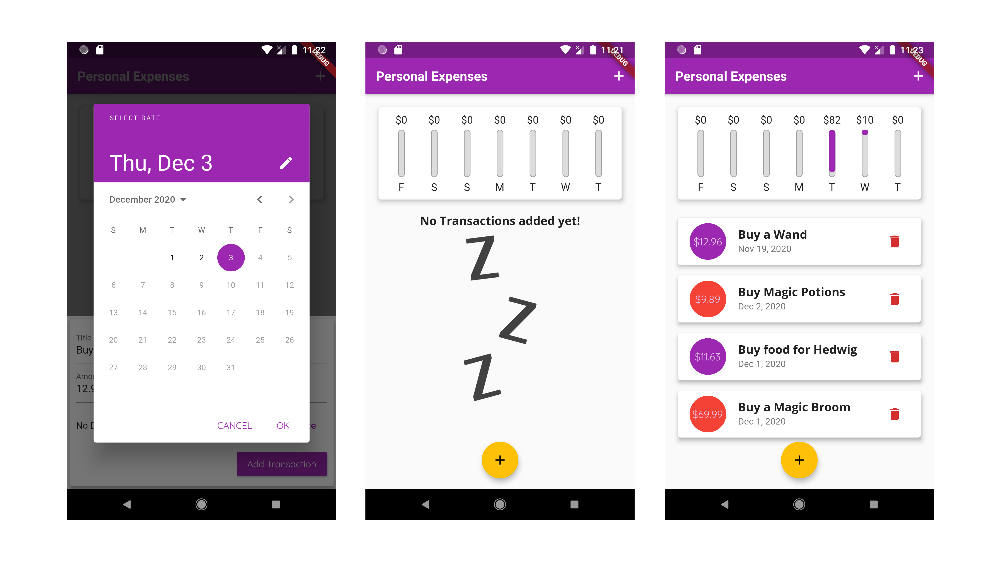

# Expense-App
Welcome Guys! This repo consists of my code for Expense App made using Flutter, which I made as a part of my course, Flutter & Dart: The Complete Guide. I have attached some screenshots of the Application as a Reference. Make sure to leave me some Feedback.  

# Features
- Use of Basic Flutter Widgets
- Use of widgets like Row, Column, ListView etc
- Theming the App
- Using 3rd Party Packages
- Images
  
 
 

  
I'll be waiting for your precious feedback.  
Happy Coding :)

